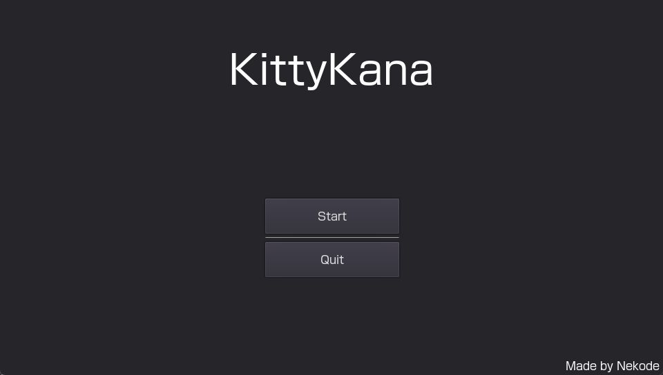

# KittyKana

<!-- # Short Description -->

PlayStation Vita game for learning Hiragana, Katakana, etc.

<!-- # Badges -->

# Tags

`learning` `kana` `hiragana` `psvita`

# Demo

Placeholder...

# Installation

1. Download the VPK from the Releases section
2. Place the VPK on your PlayStation Vita or Vita TV
3. Install it using VitaShell

# Deployment

The only dependency is [SonicMastr's fork of Godot Engine.](https://github.com/SonicMastr/godot)

# Contributors

- [Avellea](https://github.com/Avellea)

<!-- CREATED_BY_LEADYOU_README_GENERATOR -->